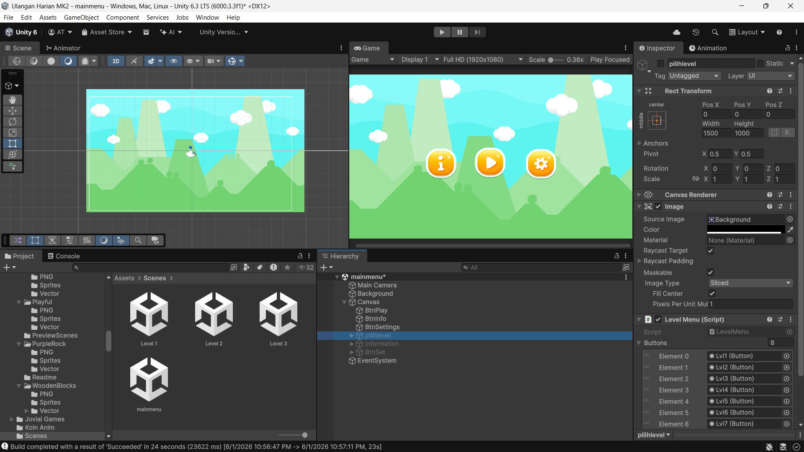
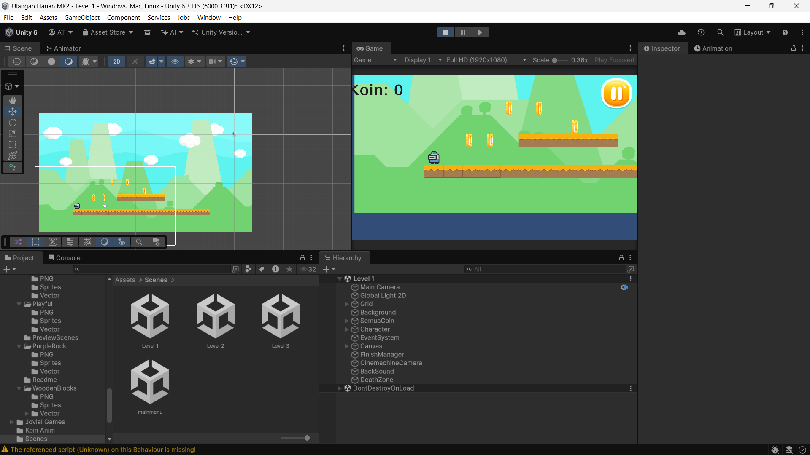
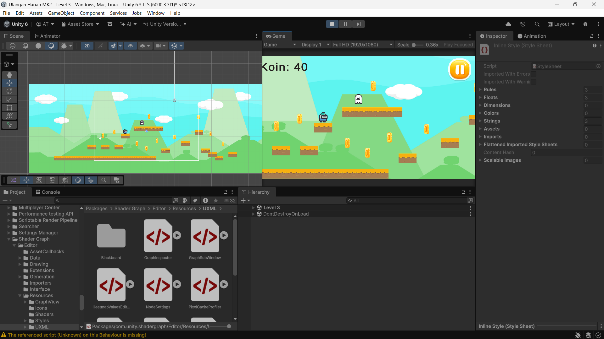

# Coin Rush Game

A 2D platformer game built with Unity where you collect all coins to complete each level.

---

## Deskripsi

Coin Rush adalah game platformer 2D yang dibuat menggunakan Unity. Pemain harus mengumpulkan semua koin yang tersebar di setiap level untuk menyelesaikan permainan. Hindari musuh dan jangan sampai jatuh ke jurang.

---

## Screenshots

### Main Menu

### Level 1

### Level 3

---

## Cara Bermain / Control

| Tombol | Fungsi |
|---|---|
| A / Panah Kiri | Gerak ke kiri |
| D / Panah Kanan | Gerak ke kanan |
| Space | Lompat |
| P / Esc | Pause game |

### Tujuan
- Kumpulkan semua koin di setiap level
- Setelah semua koin terkumpul, panel Level Complete akan muncul
- Selesaikan semua level untuk memenangkan permainan

### Hindari
- Musuh yang berjalan bolak-balik di atas platform
- Jurang — jatuh ke bawah berarti permainan gagal dan mengulang dari awal

---

## Level

| Level | Keterangan |
|---|---|
| Level 1 | Level pemula, tersedia dari awal |
| Level 2 | Terbuka setelah Level 1 selesai |
| Level 3 | Terbuka setelah Level 2 selesai |

---

## Teknologi

- Unity 6.3 LTS
- C#
- TextMeshPro

---

## Developer

**AryaTeguh** - [@teguh-web](https://github.com/teguh-web)
